El presente repositorio contiene el código con el cual construyo la solución a la prueba del módulo 4 llamado **Programación avanzada en JavaScript** de la beca **Desarrollo de aplicaciones Full Stack Javascript Trainee** dictado por Desafío Latam

Las tecnologías que he utilizando son las siguientes:

Los requisitos del proyecto los muestro en las siguientes imagenes:

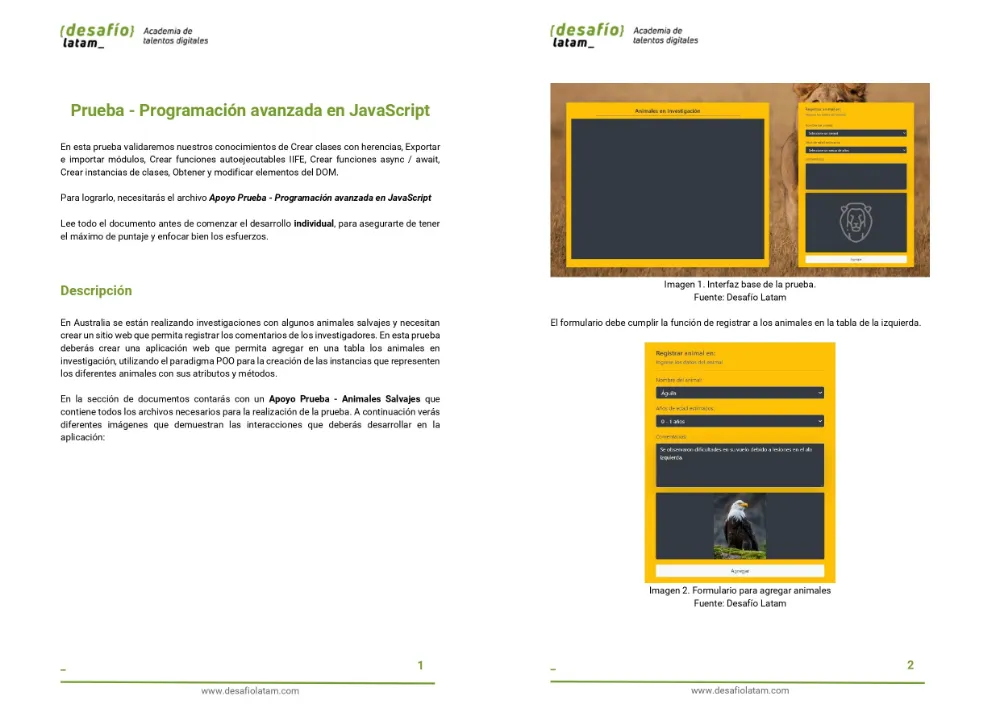
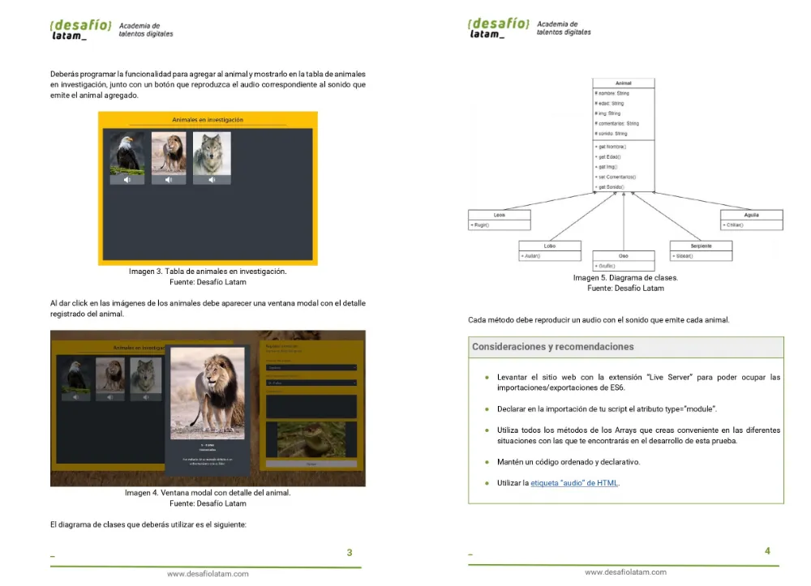
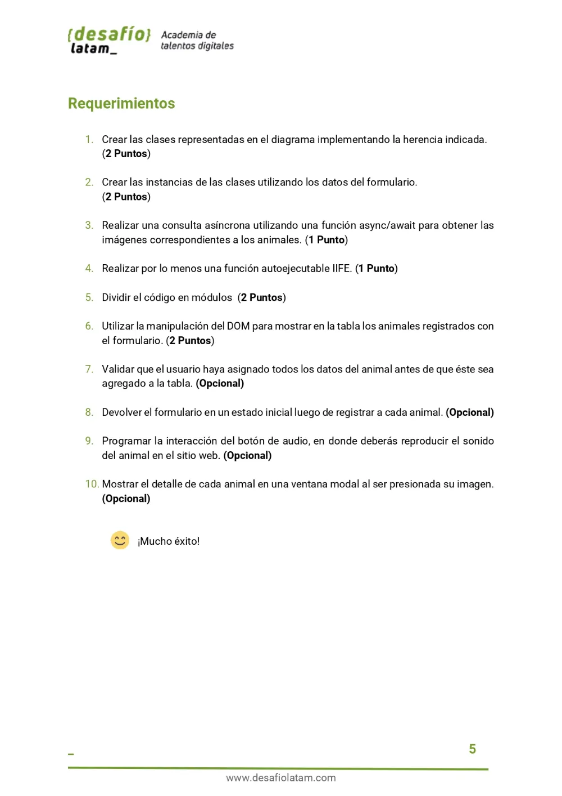

Mi proyecto es completamente responsivo. A continuación muestro screenshots del proyecto en pantallas grandes y pequeñas:

### 1. Screenshot pantallas grandes

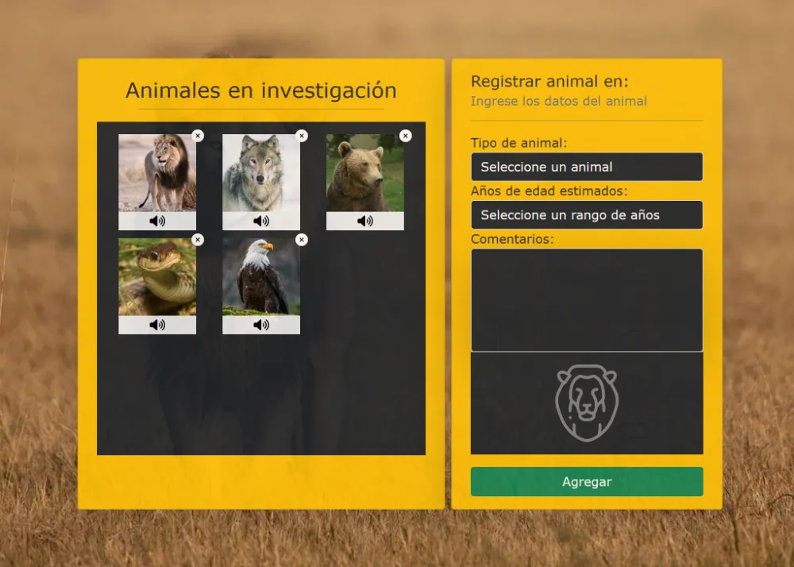

### 2. Screenshot pantallas small

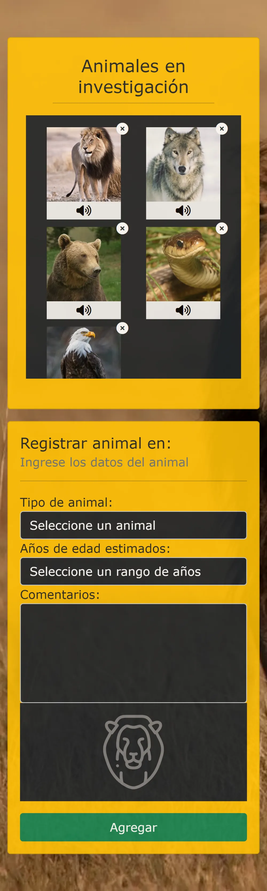

A continuación muestro code snippet de mis implementaciones de los requisitos:

### 1. Crear las clases representadas en el diagrama implementando la herencia indicada.

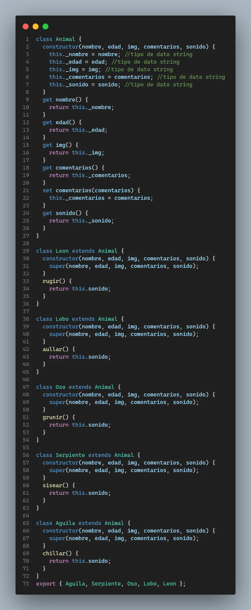

### 2. Crear las instancias de las clases utilizando los datos del formulario.

Creo la instancia una vez que recibo la data del formulario de manera dinámica como muestro en la línea 5.

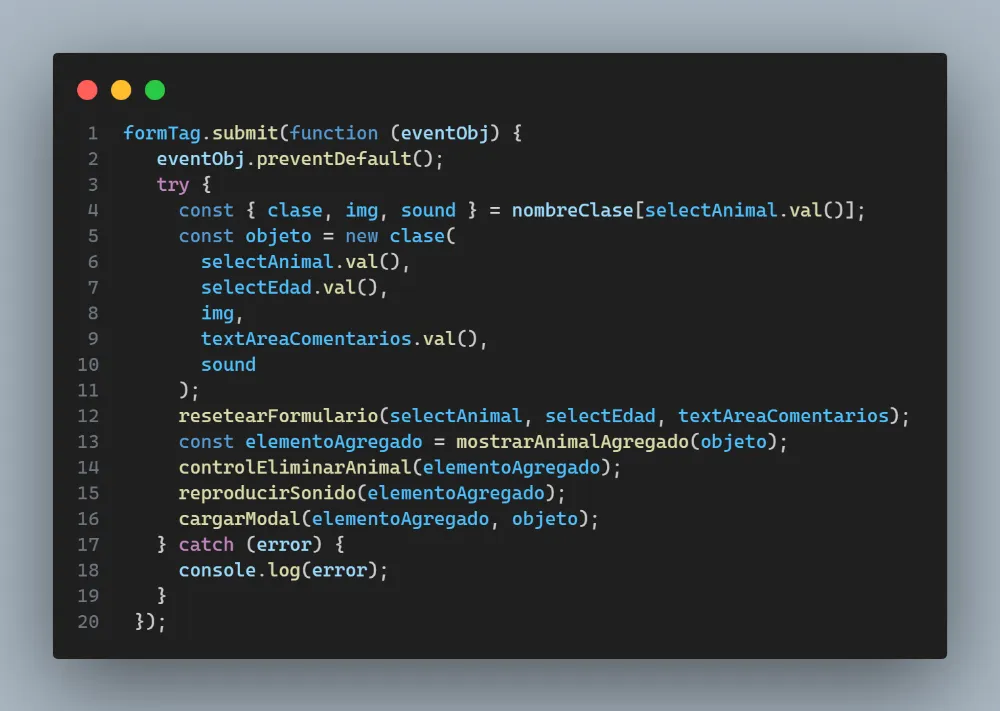

### 3. Realizar una consulta asíncrona utilizando una función async/await para obtener las imágenes correspondientes a los animales

Realizo una IIFE (Immediately Invoked Function Expression) que hace fetch a la data almacenada en el archivo **animales.json**. Dicho archivo lo he modificado solo en relación al tipo de archivo. Luego de cargada la data, procedo a almacenarla en una variable global. Dicha variable global la usaré para crear un objeto el cual posee la **clase respectiva** a la que pertenece el animal y esta clase la utilizo para crear la instancia.

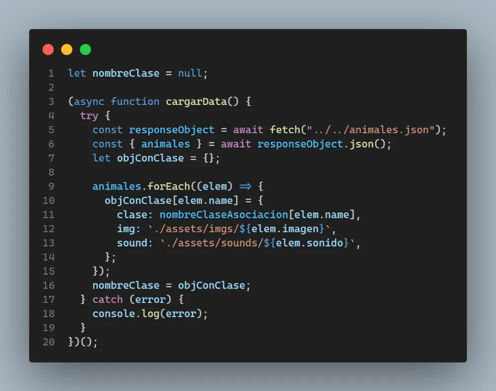

### 4. Realizar por lo menos una función autoejecutable IIFE

El código que muestro en el punto 3 anterior es IIFE

### 5. Dividir el código en módulos

He creado el archivo **modulos.js** el cual posee todas las clases para luego exportarlas y crear objetos en el archivo **script.js**

### 6. Utilizar la manipulación del DOM para mostrar en la tabla los animales registrados con el formulario.

Para mostrar el animal en el canvas izquierdo he creado la función **mostrarAnimalAgregado** la cual posee como parámetro el objeto creado al completar los campos del formulario y al hacer click en el botón **Agregar** del formulario.

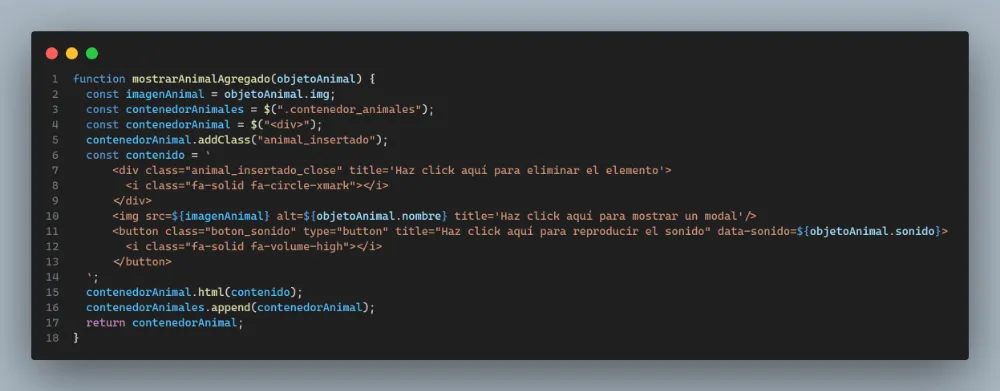

### 7. Validar que el usuario haya asignado todos los datos del animal antes de que éste sea agregado a la tabla. (Opcional)

He utilizado validez en el html no permitiendo el ingreso de valores en blanco ya sea en los select y en el textarea vía atributo **required**

### 8. Devolver el formulario en un estado inicial luego de registrar a cada animal. (Opcional)

Para resetear el formulario he creado la función **resetearFormulario** la cual presenta como parámetros los input del formulario los cuales luego sus valores son seateados a una cadena vacía

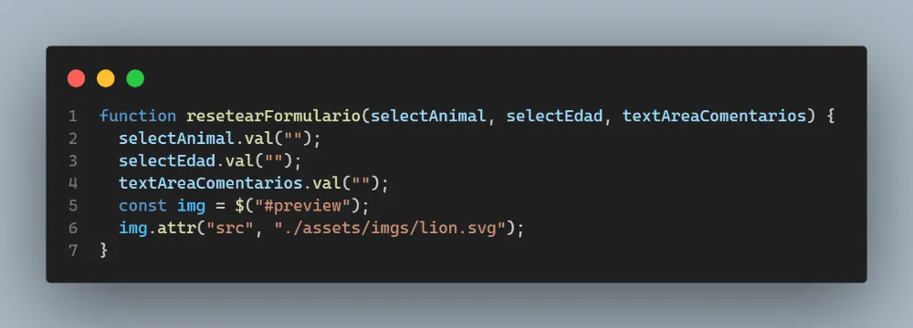

### 9. Programar la interacción del botón de audio, en donde deberás reproducir el sonido del animal en el sitio web. (Opcional)

Para reproducir audio de cada animal he creado la función **reproducirSonido**:

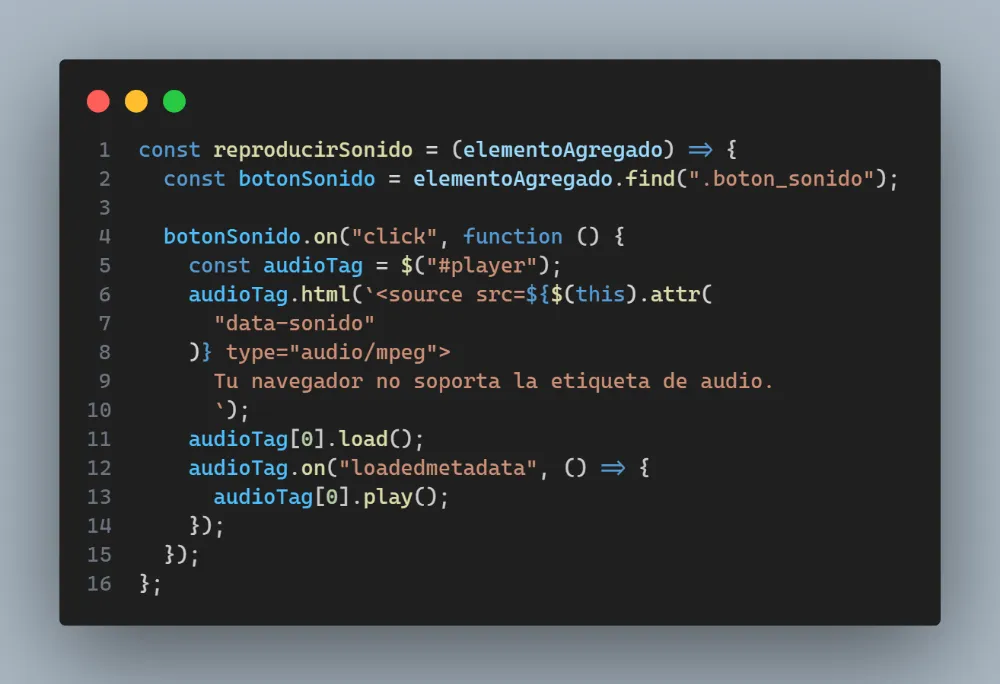

### 10. Mostrar el detalle de cada animal en una ventana modal al ser presionada su imagen. (Opcional)

Para mostrar el modal he creado la función **cargarModal** siguiente:

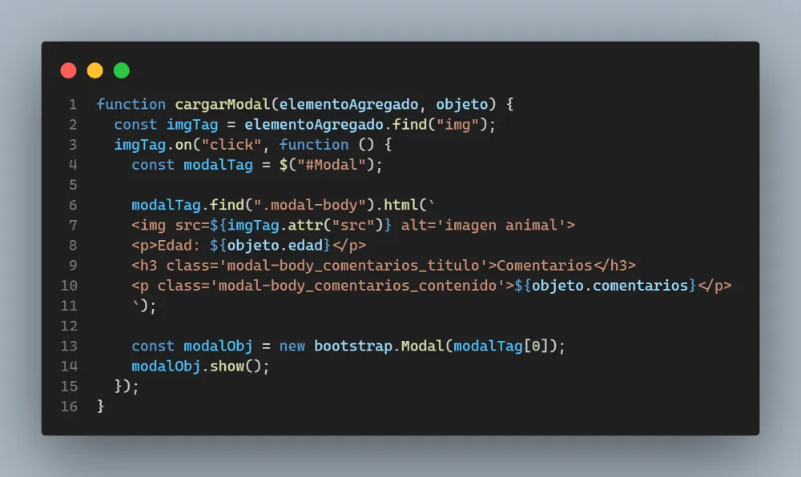

Por último, además implementé la funcionalidad de eliminar los elementos ya agregados al canvas creando la función **controlEliminarAnimal** siguiente:

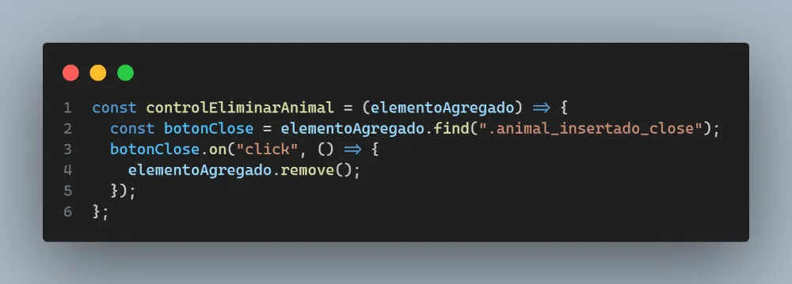
